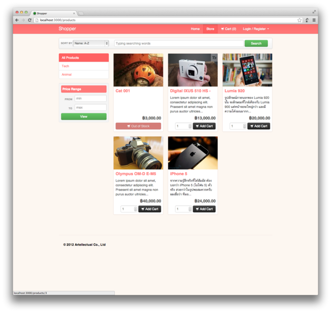

We're releasing our shopper app on github, free of charge! This is the app that we use to demo to our. Your welcome to do with it as you please. Enjoy!

## Feature List

+ User Registration / Sign In
+ Admin Interface
+ Product Management (Creating, Updating, Deleting)
+ Image Uploading
+ Product Search and Browsing
+ Product Categorisation
+ Shopping Cart
+ Transactional Emailing
+ Invoicing
+ Order History
+ Stock Keeping
+ Shipping Rates Calculation
+ Checking Out
+ Customer Profile Page
+ Address Management

## Installation

Please see this [playlist](http://www.youtube.com/playlist?list=PLjQo0sojbbxUav7I746f0lT4apGX8-iON) on youtube for tutorial on how to deploy a rails app.

## Quick Overview

What the fine folks at Ruby5 had to say about it!

[Ruby5 Episode 420 (Nov 19th 2013)](http://ruby5.envylabs.com/episodes/456-episode-420-november-19th-2013)